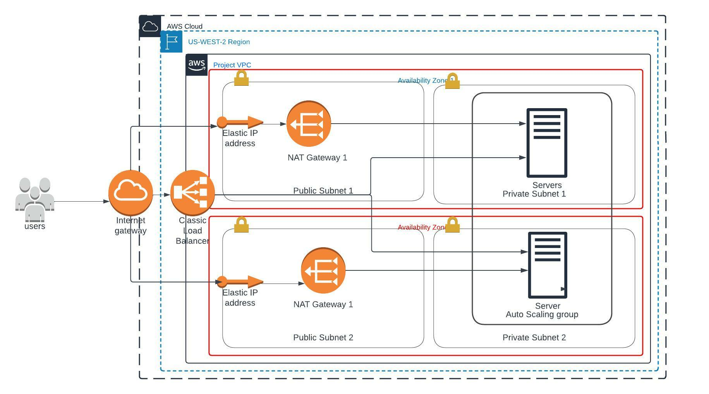

### Project Title - Deploy a high-availability web app using CloudFormation
This folder provides the starter code for the "ND9991 - C2- Infrastructure as Code - Deploy a high-availability web app using CloudFormation" project. This folder contains the following files:


#### final-project-starter.yml
Students have to write the CloudFormation code using this YAML template for building the cloud infrastructure, as required for the project. 

#### server-parameters.json
Students may use a JSON file for increasing the generic nature of the YAML code. For example, the JSON file contains a "ParameterKey" as "EnvironmentName" and "ParameterValue" as "UdacityProject". 

In YAML code, the `${EnvironmentName}` would be substituted with `UdacityProject` accordingly.

### Diagram



### Usage

Make sure you have the following installed:

- [AWS CLI](https://docs.aws.amazon.com/cli/latest/userguide/cli-chap-install.html)

Set up your AWS credentials:

``` bash
aws configure
```

To create the infrastructure, run the following command:

``` bash
# Create the infrastructure
# Clone the repo
git clone https://github.com/ifeLight/udacity-udagram-submision.git project-app

# Change directory
cd project-app

# Make the script executable
sudo chmod +x create-servers.sh

# Run the script, replace {stack-name} with your own stack name
./create-servers.sh {stack-name}
```

To update the infrastructure, run the following command:

``` bash
# Make the script executable
sudo chmod +x update-servers.sh

# Run the script, replace {stack-name} with your own stack name
./update.sh {stack-name}
```

To delete the infrastructure, run the following command:

``` bash
# Make the script executable
sudo chmod +x delete-servers.sh

# Run the script, replace {stack-name} with your own stack name
./delete.sh {stack-name}
```

#### A sample link

``` bash
http://udagram-webapploadbalancer-1743127452.us-west-2.elb.amazonaws.com/
```
